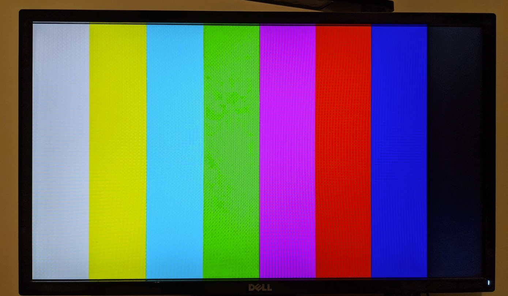

# Poly94 computing platform




## Connecting ULX3S

You need to connect to USB1 (US1) connector to the host computer in order to program the board.


## Development environment

Highly recommended to use the YosysHQ [OSS CAD Suite](https://github.com/YosysHQ/oss-cad-suite-build). It includes all of the necessary tools (and many more):
- Yosys
- nextpnr-ecp5
- Verilator
- Icarus Verilog
- Python & cocotb

## Build and program bitstream

```
make ulx3s.bit    # (optional)
make prog
```

## Testing

```
# Verilator (currently not working with SDRAM model)
make sim

# Verilator with options
BOOTROM=firmware/build/test_framebuffer.bin DUMP_FRAMEBUF=framebuffer.ppm NUM_CYCLES=4000000 make sim

# cocotb
make -f Makefile.coco
```
