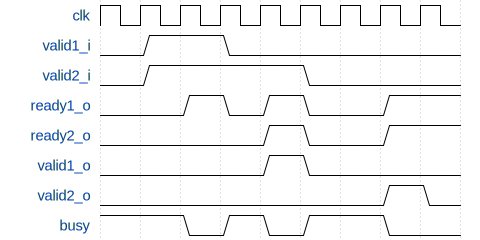

A collection of SystemVerilog patterns that synthesize, simulate and read well


## Async-asserted, sync-released reset

```sv
always_ff @ (posedge clk_i, posedge rst_i) begin
    if (rst_i) begin
        // Reset all registers
    end else begin
        // Normal operation
    end
end
```


## Single-master READY-VALID interface, 1-cycle turnaround

Background: http://www.cjdrake.com/readyvalid-protocol-primer.html

In general: master should assume that slave sets `ready` as a combinatorial function of inputs
            (for example, it might be ready to accept a write, but not a read).

Therefore, master must not wait for slave to be ready before sending its request (a deadlock might arise).

### Slave

TODO: change to Cummings-style FSM

```sv
module Slave(
    input           clk_i,
    input           rst_i,

    input           valid_i,
    output          ready_o,

    output[15:0]    response_o,
    output          valid_o
)

reg busy;

assign ready_o = !busy;

always_ff @ (posedge clk_i) begin
    response_o <= 'x;
    valid_o <= '0;

    if (rst_i) begin
        busy <= '0;
    end else if (!busy) begin
        if (valid_i) begin
            busy <= '1;
        end
    end else begin
        busy <= '0;

        response_o <= 123;
        valid_o <= '1;
    end
end
```

### Master

```sv
// Start
valid_o <= 1;
in_flight <= 1;
...
// Check
if (ready_i) begin
    valid_o <= 0;  // or directly send next request if ready
end
```


## 2-master READY-VALID interface, 1-cycle turnaround



### Slave

```sv
reg busy;
reg master_select;

assign ready1_o = !busy;
assign ready2_o = !busy && !valid1_i;

always_comb begin
    if (valid1_i) begin
        req_addr_comb = addr1_i;
    end else begin
        req_addr_comb = addr2_i;
    end
end

always_ff @ (posedge clk_i) begin
    response_o <= 'x;
    resp_valid1_o <= '0;
    resp_valid2_o <= '0;

    if (rst_i) begin
        busy <= '0;
        master_select <= 'x;
    end else if (!busy) begin
        if (valid1_i) begin
            busy <= '1;
            master_select <= 0;
        end else if (valid2_i) begin
            busy <= '1;
            master_select <= 1;
        end
    end else begin
        busy <= '0;
        response_o <= 123;

        if (master_select == 0) begin
            resp_valid1_o <= '1;
        end else begin
            resp_valid2_o <= '1;
        end
    end
end
```


## 2-master READY-VALID interface, 0-cycle turnaround (always busy / back-to-back)

### Slave

```sv
reg busy;
reg last;
reg master_select;

assign ready1_o = !busy || last;
assign ready2_o = ready1_o && !valid1_i;

// TODO
```
