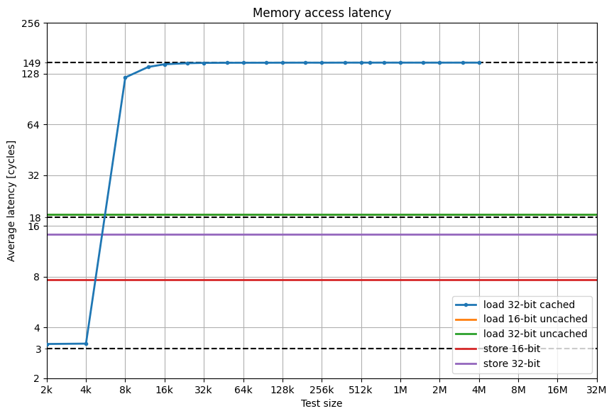

================
SDRAM Controller
================

Interface
=========

The interface of the SDRAM controller looks like this::

    // system interface
    input  wire        sys_clk,             // CLK 25 Mhz
    input  wire        sys_rd,              // read word
    input  wire        sys_wr,              // write word
    output reg         sys_rdy = 1'b0,      // mem ready
    input  wire        sys_ack,             // mem cycle end
    input  wire [23:0] sys_ab,              // address
    input  wire [15:0] sys_di,              // data in
    output reg  [15:0] sys_do,              // data out
    input  wire  [1:0] sys_wmask,           // byte mask
    input              burst_i,

    // sdram interface
    output wire  [3:0] sdr_n_CS_WE_RAS_CAS, // SDRAM nCS, nWE, nRAS, nCAS
    output wire  [1:0] sdr_ba,              // SDRAM bank address
    output reg  [12:0] sdr_ab,              // SDRAM address
    input  wire [15:0] sdr_q,               // SDRAM output data
    output wire [15:0] sdr_d,               // SDRAM input data
    output reg         sdr_dq_oe,
    output reg   [1:0] sdr_dqm = 2'b11      // SDRAM DQM

The system-side protocol is based on handshaking, which allows it to cross clock domains,
but as a result it is very inefficient if everything runs off the same clock.
In our case, it would be more useful to have a low-overhead interface with burst capability.

A transaction is started by asserting ``sys_rd`` or ``sys_wr`` and the signal must be held up
until the controller reports completion by raising ``sys_rdy``.
The master must acknowledges this via ``sys_ack``.

A simple read transaction, assuming CL=2 and row already open, looks like this:

0. The master asserts ``sys_rd`` together with providing an address in ``sys_ab``
1. ``IDLE      .`` Transition to RDWR
2. ``RDWR      .`` Set cmd=READ, ab=column, dly=1. Transition to WAITING.
3. ``WAIT, dly=1`` Decrement dly. Set cmd=NOP.
4. ``WAIT, dly=0`` Transition to RWRDY.
5. ``RWDRY     .`` Latch read result, transition to ACKWT, assert ``sys_rdy``
6. ``ACKWT     .`` Data is ready. Master clears ``sys_rd`` and issues acknowledge.
7. ``ACKWT     .`` Acknowledge is received. ``sdram_busy`` is cleared.
8. ``IDLE      .`` New cycle: Master sees SDRAM idle and asserts ``sys_rd`` together with providing an address in ``sys_ab``

This is what it looks like: yellow is MemControl<->arbiter, orange is arbiter<->SDRAM and red is the external SDRAM interface.

..
    Captured like this:
    BOOTROM=firmware/build/boot_sdram.bin NUM_CYCLES=205 SDRAM_PRELOAD=firmware/build/demo_memory_latency.bin TRACE_START=65 make sim

Bandwidth & latency
===================

Data can be read from the 4-kilobyte data cache in 3 cycles, but SDRAM access is *very* slow due to missing burst capability.

16-bit uncached reads are also broken and take the same amount of time as 32-bit reads.

Framebuffer bandwidth usage
---------------------------

These calculations assume one 16-bit transfer per clock.
A VGA frame is 420 000 cycles (800x525 pixels incl. blanking) at 25 MHz, so 840 kc at 50 MHz.
Lower resolutions (320x240) still use the same VGA frame -- right now letterboxed, in the future maybe scaled.

.. missing the script for the following table?

.. list-table::
   :header-rows: 1

   * - Memory clock
     - Resolution + bit depth
     - Bandwidth usage (excl. overhead)
   * - **50 MHz**
     - **320x240 /16**
     - **9.2 %**
   * - 50 MHz
     - 640x480 /8
     - 19 %
   * - 100 MHz
     - 320x240 /16
     - 4.5 %
   * - 100 MHz
     - 640x480 /8
     - 9.2 %
   * - 100 MHz
     - 640x480 /16
     - 18.3 %

SDRAM simulation model
======================

- We use mt48lc16m16a2.v from Micron
- Some comments + alternatives mentioned on `/r/FPGA <https://old.reddit.com/r/FPGA/comments/a5e3ok/recommend_an_sdram_model_for_verilator/>`_
- Verilator compatibility is TODO (would certainly be nice, but if not feasible, can get away with a very simple, permissive model)
